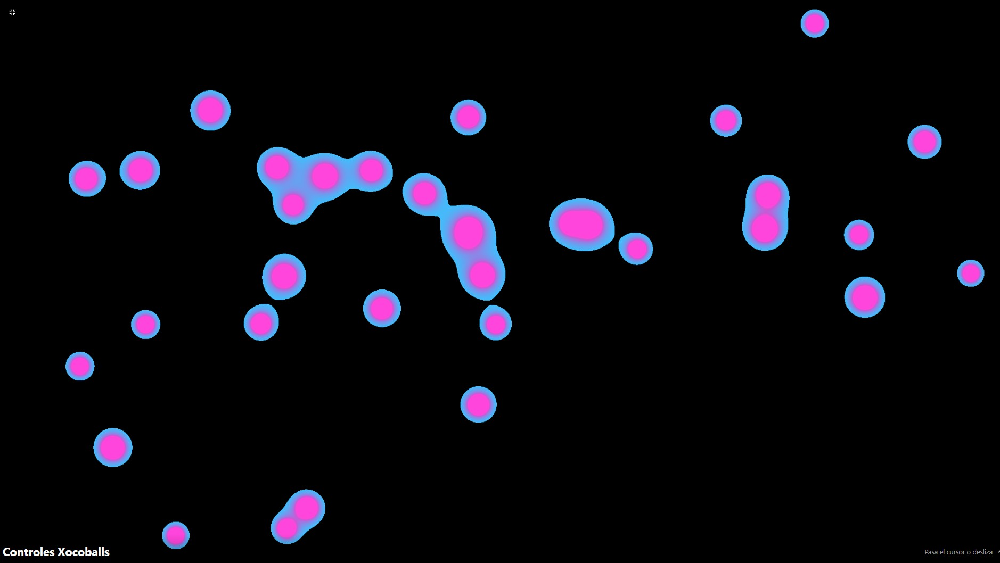

## XOCOFLOW Funcionamiento y flujo de trabajo

## Acceso Rápido a la Aplicación
[XOCOFLOW - Demo en vivo](https://xococode.github.io/xocoballs/xocoballs-svg.html)

## XocoBalls SVG

### Funcionamiento y flujo de trabajo  
- **Paper.js**: en lugar de dibujar píxel por píxel, usa `paper.setup(canvas)` y crea cada esfera como `Path.Circle`, añadiendo curvas Bézier de conexión con `handleLenRate` y `maxDistance` :contentReference[oaicite:12]{index=12}:contentReference[oaicite:13]{index=13}.  
- **Animación**: ligada a `paper.view.onFrame` para actualización de posición y fusión; `paper.view.onResize` ajusta el canvas al redimensionar :contentReference[oaicite:14]{index=14}:contentReference[oaicite:15]{index=15}.  
- **Canvas**: el `<canvas id="metaballsCanvas" resize="true">` usa propiedades de Paper.js para manejar DPI automáticamente.

### Controles  
1. **Velocidad** (`#speedSlider`): 0.1–6.0, valor inicial 1.0×, ajusta la rapidez del movimiento de las esferas :contentReference[oaicite:16]{index=16}:contentReference[oaicite:17]{index=17}.  
2. **Fusión** (`#fusionSlider`): 0.1–1.0, valor inicial 0.5, controla cuánto se deforman y unen las esferas al acercarse :contentReference[oaicite:18]{index=18}:contentReference[oaicite:19]{index=19}.  
3. **Color de Relleno** (`#fillColorPicker`): define el color uniforme de las esferas y sus conexiones :contentReference[oaicite:20]{index=20}:contentReference[oaicite:21]{index=21}.  
4. **Fondo** (`#bgColorPicker`): selector de color para el fondo del canvas.  
5. **Botones**: añadir, reiniciar, pausar/reanudar animación y “aleatorio” para cambiar el color de las formas :contentReference[oaicite:22]{index=22}:contentReference[oaicite:23]{index=23}.

---

## Acceso Rápido a la Aplicación
[XOCOFLOW - Demo en vivo](https://xococode.github.io/xocoballs/index.html)

## XocoBalls Photo

### Funcionamiento y flujo de trabajo  
- **Canvas & Offscreen**: renderizado suave con canvas offscreen y escalado con `imageSmoothingEnabled = true` para antialiasing de alta calidad :contentReference[oaicite:24]{index=24}:contentReference[oaicite:25]{index=25}.  
- **UI Container**: idéntico a la primera versión optimizada: hover/focus para desplegar, controles en filas y badge de info.  
- **Bucle de animación**: `requestAnimationFrame` con cálculo de `deltaTime` normalizado (`dt`) para físicas independientes del FPS :contentReference[oaicite:26]{index=26}:contentReference[oaicite:27]{index=27}.

### Controles  
- **Velocidad** (`#speedSlider`): 0.1–6.0, valor inicial 6.0×.  
- **Densidad** (`#thresholdSlider`): 0.75–1.25, valor inicial 1.25 (“Muy Baja”).  
- **Tamaño** (`#radiusSlider`): 0.5–2.0, valor inicial 1.0×.  
- **Calidad** (`#qualitySlider`): 1–4 (Baja, Media, Alta, Ultra), valor inicial 1×.  
- **Selectores de color**: fondo, inicio y fin de gradiente.  
- **Botones**: añadir bola, reiniciar posición, pausar/reanudar animación y colores aleatorios.  
- **Fullscreen**: botón dedicado para entrar/salir de pantalla completa.

---

## XocoBalls “Pixelado”

### Funcionamiento y flujo de trabajo  
- **Canvas principal**: igual que la versión optimizada, pero con CSS `image-rendering: pixelated` para un acabado “grueso” de píxeles (nítido) en `<canvas>` :contentReference[oaicite:0]{index=0}:contentReference[oaicite:1]{index=1}.  
- **Offscreen & Pixelado**: se crean dos canvases internos, uno de alta resolución y otro para aplicar el efecto de pixelado antes de volcar al visible :contentReference[oaicite:2]{index=2}:contentReference[oaicite:3]{index=3}.  
- **UI Container**: `.ui-container` mantiene el mismo comportamiento desplegable (hover/focus), pero añade `max-height: 90vh` y `overflow-y: auto` para scroll en móviles :contentReference[oaicite:4]{index=4}:contentReference[oaicite:5]{index=5}.  
- **Badge de Info**: aparece con transición al cambiar cualquier control y se oculta tras 2 s.

### Controles adicionales  
1. **Intensidad de Brillo** (`#glowIntensitySlider`): rango 0–200 (valor inicial 75), ajusta cuánto resalta el glow en los centros de fusión :contentReference[oaicite:6]{index=6}:contentReference[oaicite:7]{index=7}.  
2. **Umbral de Brillo** (`#glowThresholdSlider`): rango 1.0–2.0 (valor inicial 1.5), define a partir de qué valor de “influencia” empieza el glow :contentReference[oaicite:8]{index=8}:contentReference[oaicite:9]{index=9}.  
3. **Pixelado** (`#pixelationSlider`): rango 1–16 (valor inicial 1 = ninguno), controla el factor de pixelación escalando la resolución del canvas offscreen :contentReference[oaicite:10]{index=10}:contentReference[oaicite:11]{index=11}.  

El resto de controles (velocidad, densidad, tamaño, calidad, colores, botones de añadir/reiniciar/pausa/aleatorio) funcionan idénticos a la versión base.

---

